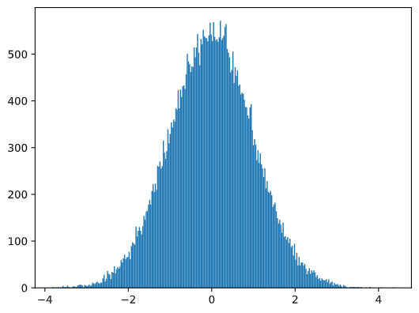
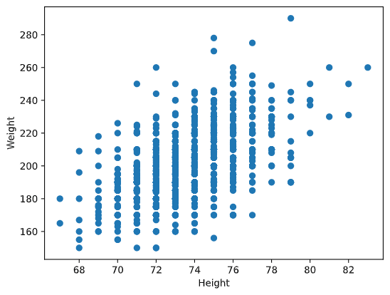

# Pourquoi les statistiques sont-elles au coeur de la science des données ? 

Pourquoi tout de suite aborder des concepts comme les distribution, la médiane, la variance, et la statistiques quand on parle de données ? 

## La statistique comme science du très grand (et je ne parle pas de Dieu)

Car la statistique, c'est la science du **très grand et des phénomènes à grande échelle**. Les individus ou, plus généralement les faits isolés sont comme des fils que l'on peut tirer vers des données. Quand on rassemble ces fils et qu'on les classe, on obtient des paquets, qui, presque par magie ont toujours la même forme. 

Dites-vous qu'à une petite échelle, une donnée, c'est un point. Vous, moi, votre chien, c'est un point. A grande échelle, les hommes, les chiens, quand on veut regarder de quoi ils sont constitués, lorsqu'on veut les décrire rigoureusement, on a à faire à des distributions. On peut aussi penser les distributions comme le tableau d'un peintre qui donnerait dans le pointillisme. L'ensemble des petits points finissent par esquisser une image, une distribution. 


## Le lien entre les données et les statistiques

Le lien entre données et statistiques se trouvent là. **LA** statistique nous donne les lois qui régissent le grand aléatoire que sont les données, qui vous caractérisent, caractérisent votre chien, me caractériste. Laissez tomber des billes aléatoirement, elles formeront toujours une forme plus ou moins semblable. Magique vous dites ? Non, juste statistique


Figure 1: Boite de galton qui représente une distribution normale, disponible dans la collection de Matemateca IME-USP


### Les statistiques comme science du comportement des données.

La statistique régit le grand aléatoire que sont les données. En cela la statistique nous donne des informations sur le comportement de toute variable prise indépendamment de toutes les autres (on parle de variable _aléatoire_) : prix d'un actif financier, taille d'un individu, nombre de personnes dans un foyer, probabilité de gagner à un jeu de hasard, etc.

Une manière utile de penser la statistique peut être de la voir comme une science du comportement. A la différence près qu'elle n'étudie pas le comportement d'un être humain ou d'une espèce vivante mais plutôt le comportement des données en grandes quantités. Or, comme les êtres vivants, les nombres suivent des lois qui se retrouvent partout. 

Une loi fondamentale veut que si vous prenez une mesure et que vous répetez l'opération un très grand nombre de fois, alors l'ensemble des mesures prises (dite distribution) suivra une loi normale. Autrement dit : 
* si vous mesurez et visualisez la taille de 1000 personnes, vous obtiendrez une distribution normale
* si vous mesurez et visualisez la vitesse de pointe de 1000 chiens, vous obtiendrez une distribution normale
* si vous mesurez le poids de 1000 arbres, vous obtiendrez une distribution normale. 

Cette distribution normale prend la forme d'une cloche (d'où le fait qu'on l'a nomme aussi _distribution en cloche_) : 



*Distribution normale d'une variable (augmentation du salaire annuel en %) avec une moyenne de 0 et une déviation standard de 1*


> **_Studio d'interaction_**   
> 1. Sur n'importe quelle plateforme open data, téléchargez un fichier de données
> 2. Choisissez une variable quantitative
> 3. Dessinez un graphique avec en abscisse les valeurs uniques de la variable et en ordonnée le nombre de fois que chaque valeur apparait dans le jeu de données.
> 4. Regardez la forme de votre graphique 
>
>      
>


## Evaluer le comportement des données grâce à des tests d'hypothèses

L'avantage d'avoir des données avec un comportement fixe et fixés dans les lois statistiques, c'est qu'on peut établir avec une précision très précise des faits qui autrement reste dans le vague. Par exemple : votre intuition vous dit que les prix de l'immobilier autour de vous sont plus chers que dans le voisinnage de vos parents. Mais est-ce vraiment le cas ? Les données avec l'aide des statistiques peuvent permettre d'apporter une réponse claire et définitive à cette question. 

A ce stade, les statistiques vont servir de loupe pour mieux comprendre le comportement de certaines données. A la manière d'un détective. D'ailleurs, ce n'est pas un hasard si le Sherlock Holmes originel de Sir Arthur Conan Doyle fait usage d'observation et de raisonnement. statistiques dans ces enquêtes : elles sont bien un outil d'investigation. 

La différence entre Sherlock Holmes et nous tient à ce que nous ne résolvons pas des affaires criminelles mais que nous voulons **tester des hypothèses**

> **_Studio d'interaction_**  
> Mettons que nous voulons évaluer si deux variables sont fondamentalement différentes : le prix de l'immobilier autour de moi est-il différent de celui autour de chez mes parents ? 
> 1. Pour commencer, récupérez au hasard le prix de 20 actifs immobiliers autour de chez vous et 20 actifs immobiliers autour de chez vos parents.
> 3. Créez un graphique vide avec avec en abscisse des intervalles de prix de la variable et en ordonnée le nombre de fois que chaque valeur apparait dans cet intervalle
> 4. D'une couleur, dessinez la distribution des prix autour de chez vous et de l'autre, d'une autre, dessinez la distribution des prix autour de chez vos parents.
> 5. A vue d'oeil, est-ce que les prix sont différents ?
>
>      
>    

Un test d'hypothèse, à la traduire dans un langage plus courant : 
1. vient d'un questionnement (ci-dessus : "les prix sont-ils différents ?")
2. traduit sous la forme d'une proposition hypothétique : "les prix ne sont pas différents" ou "les prix sont différents"
3. confrontée à un test statistique sur des données et aboutissant une réponse définitive : "vrai" ou "faux"
4. la réponse binaire permettant ensuite de répondre à la proposition hypothétique : oui, "les prix sont différents" ou non, "les prix ne sont pas différents" 

La clé ici est de comprendre que **le test d'hypothèse n'est qu'une manière de formuler différemment une question**. L'interactions homme-données peut à mains égards se comparer à un travail de traduction entre deux langues avec d'un côté le langage courant que nous utilisons au quotidien (facile à utiliser mais peu précis) et de l'autre le langage des données (précis mais difficile à utiliser).

Aussi s'agit-il de comprendre que la force du test statistique est de pouvoir répondre à des questions avec une très grande précision mais aussi de pouvoir dire dans quelle mesure on peut généraliser la réponse à la question. Dans notre exemple, le test va permettre de dire dans quelle mesure **tous les prix** de l'immobilier autour de chez moi sont différents de **tous les prix** autour de chez mes parents et ceux, uniquement avec des données restreintes. 

On dit alors des statistiques qu'elles ont des **capacités inférentielles** : elles permettent d'induire les caractéristiques d'un groupe général à partir de celles d'un groupe particulier. Imaginez la puissance d'une telle capacité : 
* ce sont elles qui permettent de mettre des vaccins ou des médicaments sur le marché
* de s'assurer de la rentabilité ou de l'efficacité d'un produit avant son lancement
* de prédire le comportement d'une population à partir de l'obersation du comportement d'un groupe d'individus

Le prix d'une telle puissance passe par une formalisation rigoureuse et de l'introduction de probabilités. C'est ce que nous allons voir dans la suite de cette leçon.

## Formaliser le test d'hypothèse pour apporter une réponse précise

Plus formellement, le problème que nous essayons de résoudre consiste à savoir  si **les deux distributions sont les mêmes**. Pour cela nous devons faire un test d'hypothèses. Si nous savons que les distributions sont normales, nous pouvons par exemple appliquer : 
* le **[test t de Student](https://fr.wikipedia.org/wiki/Test_t_de_Student)**
* le khi-deux de **[Pearson](https://fr.wikipedia.org/wiki/Test_du_%CF%87%C2%B2)**

> **Anecdote**
> Le test t de Student a été nommé ainsi car son inventeur William Sealy Gosser a publié un article sous le nom de plume de "Student". Il travaillait dans une brasserie et son employeur ne voulait pas que le public sache qu'ils utilisaient des tests statistiques pour déterminer la qualité des matières premières.

### Etape 1 : déterminer la population à partir de l'échantillon grâce aux intervalles de confiance

Les statistiques confèrent une force rhétorique dans une prise de décision car elle permet de parler au nom de grands ensembles ou de généralités. Ce qui est difficile à assimilier je trouve, le saut conceptuel le plus difficile à faire pour nous (qui ne sommes pas nés statisticiens ou data scientist) est de comprendre que les grands ensembles ou les généralités sont **hautement probabilistes**. 

Pourquoi, me direz-vous:
* pourquoi ne pouvons-nous parler de grands ensembles qu'avec des probabilités ? 
* pouquoi ne pouvons-nous pas être certain, par exemple, que tous les hommes sont plus grands que les femmes ? 

Tout simplement car personne ne pourra jamais mesurer TOUS les hommes et TOUTES les femmes. De fait, nous ne pourrons jamais être certain à 100% de cette différence.Les statistiques nous permettent de nous rapprocher de ces certitudes sans jamais les atteindre, et ce, grâce aux probabilités. 

Dans notre exemple, nous avons récupéré des données (restreinte) sur les prix de l'immobilier autour de chez vous et autour de chez vos parents. Il faut considérer ces mesures comme deux **échantillons** de deux plus grands ensembles appelés aussi **populations** : 
* l'ensemble de tous les prix de l'immobilier autour de chez vous
* l'ensemble de tous les prix de l'immobilier autour de chez vos parents

La question à pose alors est : dans quelle mesure ces échantillons sont-ils représentatifs des plus grands ensembles ? Nous pourrions avoir de la chance et tomber sur des échantillons qui représentent exactement la diversité des prix de l'immobilier. Mais ceci est peu réaliste. Le plus probable est que nos échantillons ne représentent qu'une partie de la diversité des prix de l'immobilier. Les échantillons sont représentatifs de la population **dans certaines mesures** : les intervalles de confiance.


### Etape 2 : calculer des intervalles de confiance pour une variable

Une définition officielle d'un intervalle de confiance : 

> **L'intervalle de confiance** est l'estimation de la véritable moyenne de la population à partir de notre échantillon, qui est exacte avec une certaine probabilité (ou **niveau de confiance**).

Supposons que nous ayons un échantillon X<sub>1</sub>, ..., X<sub>n</sub> de notre distribution. Chaque fois que nous tirons un échantillon de notre distribution, nous obtenons une valeur moyenne différente &mu; ; &mu; peut donc être considérée comme une variable aléatoire. Un **intervalle de confiance** avec un niveau de confiance p est une paire de valeurs (L<sub>p</sub>,R<sub>p</sub>), telle que **P**(L<sub>p</sub>&leq;&mu;&leq;R<sub>p</sub>) = p, c'est-à-dire que la probabilité que la valeur moyenne mesurée tombe dans l'intervalle est égale à p.

> **Anecdote**
> On appelle **student distribution** (d'où le nom de test t de Student) la distribution de la moyenne &mu; tirée de l'échantillon par rapport à la moyenne &mu; de la population. 

Par exemple, mettons que nous calculions la prix moyen (en k euros) des logements. A partir d'un échantillon nous aurions pu calculer les intervelles de confiance suivant :

| p | Moyenne (prix en k euros) |
|-----|-----------|
| 0.85 | 201.73±0.94 |
| 0.90 | 201.73±1.08 |
| 0.95 | 201.73±1.28 |

Ce tableau se lit de la manière suivante : d'après notre échantillon, la moyenne des prix des logements est de 201.73 k€. Or, du fait de notre échantillon, nous ne pouvons pas être sûrs à 100% que c'est la vraie moyenne. Nous pouvons seulement dire que la vraie moyenne est probablement proche de 201.73 livres. Pour être plus précis, nous pouvons dire que : 
- la probabilité que la vraie moyenne soit comprise entre 201.73-0.94 k€ et 201.73+0.94 k€ est de 85%
- la probabilité que la vraie moyenne soit comprise entre 201.73-1.08 k€ et 201.73+1.08 k€ est de 90%
- la probabilité que la vraie moyenne soit comprise entre 201.73-1.28 k€ et 201.73+1.28 k€ est de 95%


Ce raisonnement, nous pouvons l'appliquer sur chacune des variables de confiance. 


### Etape 3 : comparer les intervalles de confiance de chaque variable


#### Analyse visuelle

Une première approche ici pourrait être de visualiser sur un même graphique les distributions des valeurs moyennes propres à chaque échantillon. 

Pour savoir si les deux distributions sont différentes, nous pourrions regarder sur le graphique si le centre des deux distributions (qui, soit dit en passant représentent les intervalles de confiance les plus élevés) se chevauchent. 

Si elles ne se chevauchent pas, nous pourrions dire que les deux distributions sont différentes et donc que les prix de l'immobilier autour de chez vous sont différents de ceux autour de chez vos parents. La position relative des deux distributions permettra ensuite d'affirmer si les prix sont plus élevés ou plus bas autour de chez vous.


| Confidence | First Basemen | Second Basemen |
|------------|---------------|----------------|
| 0.85 | 73.62..74.38 | 71.04..71.69 |
| 0.90 | 73.56..74.44 | 70.99..71.73 |
| 0.95 | 73.47..74.53 | 70.92..71.81 |

We can see that under no confidence the intervals overlap. That proves our hypothesis that first basemen are higher than second basemen.

#### Analyse numérique 

Nous pouvons aussi effectuer une analyse numérique qui consiste à calculer ce que l'on appelle la **valeur-t**, qui indique la différence entre les moyennes avec un niveau de confiance donné : la célèbre **p-value** (vous avez peut être déjà entendu des amoureux des chiffres débattre d'un résultat et poser la question : "ok mais quelle p-value ?"). Cette **p-value** mesure la probabilité que la différence entre deux distributions soit du à du pur hasard statistique. Plus cette **p-value** est basse, plus il est probable que les distributions soient réellement différentes.

Avec cette analyse nous pouvons donc établir dans quelle proportion les deux variables sont différentes avec le niveau de confiance que nous pouvons accorder à cette différence calculée. 

En Python, nous pouvons utiliser le paquet **SciPy**, qui comprend la fonction `ttest_ind` (en plus de nombreuses autres fonctions statistiques utiles !). Elle calcule la valeur t pour nous, et fait également la recherche inverse de la valeur p de confiance, de sorte que nous pouvons simplement regarder la confiance pour tirer la conclusion.

Un exemple de code qui fait très rapidement le calcul :
```python
from scipy.stats import ttest_ind

tval, pval = ttest_ind(df.loc[df['Role']=='First_Baseman',['Height']], df.loc[df['Role']=='Designated_Hitter',['Height']],equal_var=False)
print(f"T-value = {tval[0]:.2f}\nP-value: {pval[0]}")
```
```
T-value = 7.65
P-value: 9.137321189738925e-12
```

La p-value est très faible, ce qui signifie qu'il y a de fortes chances que les deux distributions soient ici différentes.


## Comprendre le comportement des données grâce au calcul de corrélations et de covariances

L'autre pouvoir magique des statistiques, c'est de détecter des relations entre les données. On dit que deux séquences sont **corrélées** lorsqu'elles présentent un comportement similaire au même moment, c'est-à-dire qu'elles montent/descendent simultanément, ou qu'une séquence monte lorsqu'une autre descend et vice versa. En d'autres termes, il semble y avoir une certaine relation entre deux séquences.

> La corrélation n'indique pas nécessairement une relation de cause à effet entre deux séquences ; parfois, les deux variables peuvent dépendre d'une cause externe, ou la corrélation entre les deux séquences peut être purement fortuite. Cependant, une forte corrélation mathématique est une bonne indication que deux variables sont liées d'une manière ou d'une autre.

 Mathématiquement, le principal concept qui montre la relation entre deux variables aléatoires est la **covariance**, qui se calcule comme suit : Cov(X,Y) = **E**\[(X-**E**(X))(Y-**E**(Y))\]. Nous calculons l'écart des deux variables par rapport à leurs valeurs moyennes, puis le produit de ces écarts. Si les deux variables s'écartent ensemble, le produit sera toujours une valeur positive, ce qui correspondra à une covariance positive. Si les deux variables s'écartent de manière désynchronisée (c'est-à-dire que l'une tombe en dessous de la moyenne alors que l'autre monte au-dessus de la moyenne), nous obtiendrons toujours des nombres négatifs, qui s'additionneront pour former une covariance négative. Si les écarts ne sont pas dépendants, leur somme sera approximativement égale à zéro.

La valeur absolue de la covariance ne nous renseigne pas beaucoup sur l'importance de la corrélation, car elle dépend de l'ampleur des valeurs réelles. Pour la normaliser, nous pouvons diviser la covariance par l'écart-type des deux variables, pour obtenir la **corrélation**. L'avantage est que la corrélation est toujours comprise entre [-1,1], où 1 indique une forte corrélation positive entre les valeurs, -1 - une forte corrélation négative, et 0 - pas de corrélation du tout (les variables sont indépendantes).


**Exemple** : Nous pouvons calculer la corrélation entre les poids et les tailles des joueurs de baseball à partir de l'ensemble de données mentionné ci-dessus :
```python
print(np.corrcoef(weights,heights))
```
En conséquence, nous obtenons des **matrices de corrélation** comme celle-ci :
```
array([[1.        , 0.52959196],
       [0.52959196, 1.        ]])
```

> La matrice de corrélation C peut être calculée pour n'importe quel nombre de séquences d'entrée. S<sub>1</sub>, ..., S<sub>n</sub>. La valeur de C<sub>ij</sub> est la corrélation entre S<sub>i</sub> and S<sub>j</sub>, et les éléments diagonaux sont toujours égaux à 1 (ce qui correspond également à l'autocorrélation de S<sub>i</sub>).

Dans notre cas, la valeur 0,53 indique qu'il existe une certaine corrélation entre le poids et la taille d'une personne. Nous pouvons également établir un diagramme de dispersion d'une valeur par rapport à l'autre pour voir la relation visuellement :




## Credits

Cette leçon a été crée avec ♥️ by [Dmitry Soshnikov](http://soshnikov.com) et éditée par [Arthur Sarazin]()
