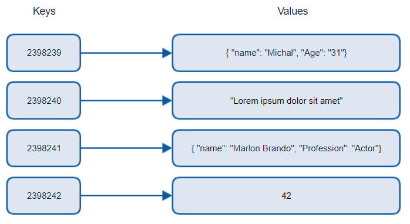
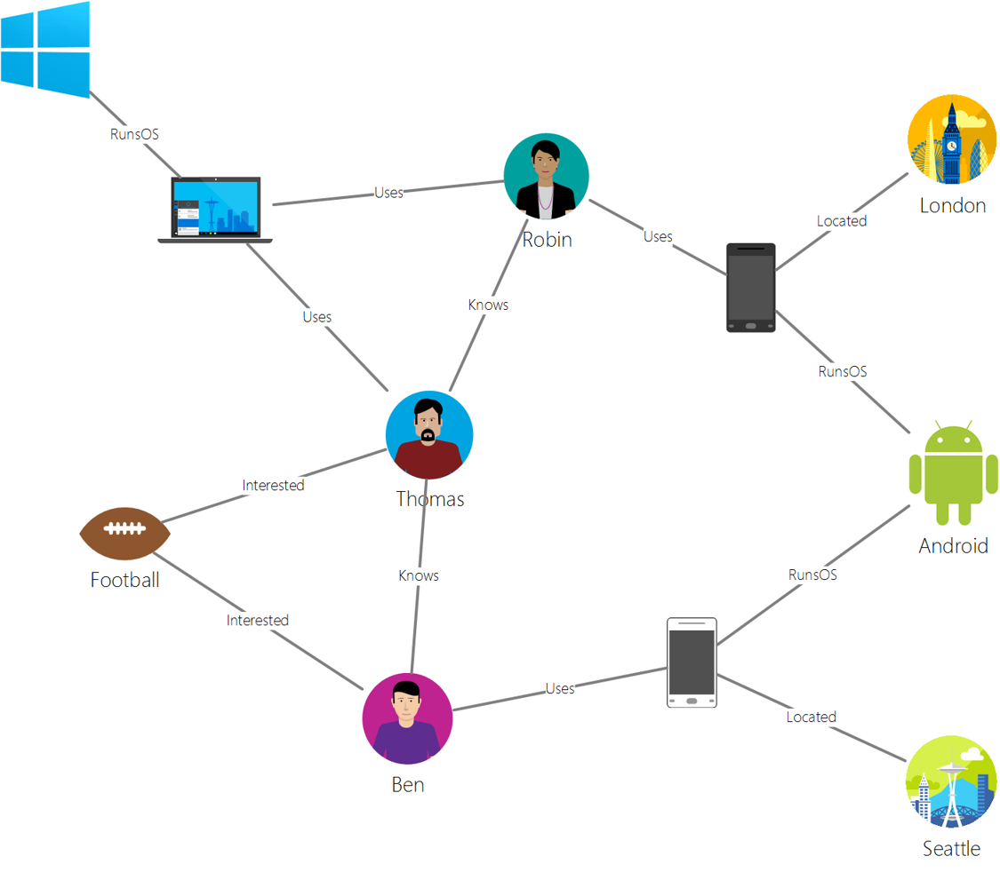

# Pourquoi des données non relationnelles ? 

| ](https://github.com/ArthurSrz/La-Data-Science-Par-Un-Nul/blob/main/sketchnotes/06-NoSQL.png?raw=true)|
|:---:|
|Working with NoSQL Data - _Sketchnote by [@nitya](https://twitter.com/nitya)_ |



> Source from [Michał Białecki Blog](https://www.michalbialecki.com/2018/03/18/azure-cosmos-db-key-value-database-cloud/)

[Key-value](https://docs.microsoft.com/en-us/azure/architecture/data-guide/big-data/non-relational-data#keyvalue-data-stores) databases pair unique keys, which are a unique identifier associated with a value. These pairs are stored using a [hash table](https://www.hackerearth.com/practice/data-structures/hash-tables/basics-of-hash-tables/tutorial/) with an appropriate hashing function.





[Columnar](https://docs.microsoft.com/en-us/azure/architecture/data-guide/big-data/non-relational-data#columnar-data-stores) 

### Document Data Stores with the Azure Cosmos DB 

[Document](https://docs.microsoft.com/en-us/azure/architecture/data-guide/big-data/non-relational-data#document-data-stores) data stores build on the concept of a key-value data store and is made up of a series of fields and objects. This section will explore document databases with the Cosmos DB emulator. 

A Cosmos DB database fits the definition of "Not Only SQL", where Cosmos DB's document database relies on SQL to query the data. The [previous lesson](../05-relational-databases/README.md) on SQL covers the basics of the language, and we'll be able to apply some of the same queries to a document database here. We'll be using the Cosmos DB Emulator, which allows us to create and explore a document database locally on a computer. Read more about the Emulator [here](https://docs.microsoft.com/en-us/azure/cosmos-db/local-emulator?tabs=ssl-netstd21).

A document is a collection of fields and object values, where the fields describe what the object value represents. Below is an example of a document.

```json
{
    "firstname": "Eva",
    "age": 44,
    "id": "8c74a315-aebf-4a16-bb38-2430a9896ce5",
    "_rid": "bHwDAPQz8s0BAAAAAAAAAA==",
    "_self": "dbs/bHwDAA==/colls/bHwDAPQz8s0=/docs/bHwDAPQz8s0BAAAAAAAAAA==/",
    "_etag": "\"00000000-0000-0000-9f95-010a691e01d7\"",
    "_attachments": "attachments/",
    "_ts": 1630544034
}
```


 


`SELECT * FROM c` returns all the documents in the container. Let's add a where clause and find everyone younger than 40.

`SELECT * FROM c where c.age < 40`


#### JSON and Documents


```json
{
    "created_at": "2021-08-31T19:03:01.000Z",
    "id": "1432780985872142341",
    "text": "Blank slate. Like this tweet if you’ve ever painted in Microsoft Paint before. https://t.co/cFeEs8eOPK",
    "_rid": "dhAmAIUsA4oHAAAAAAAAAA==",
    "_self": "dbs/dhAmAA==/colls/dhAmAIUsA4o=/docs/dhAmAIUsA4oHAAAAAAAAAA==/",
    "_etag": "\"00000000-0000-0000-9f84-a0958ad901d7\"",
    "_attachments": "attachments/",
    "_ts": 1630537000
```


