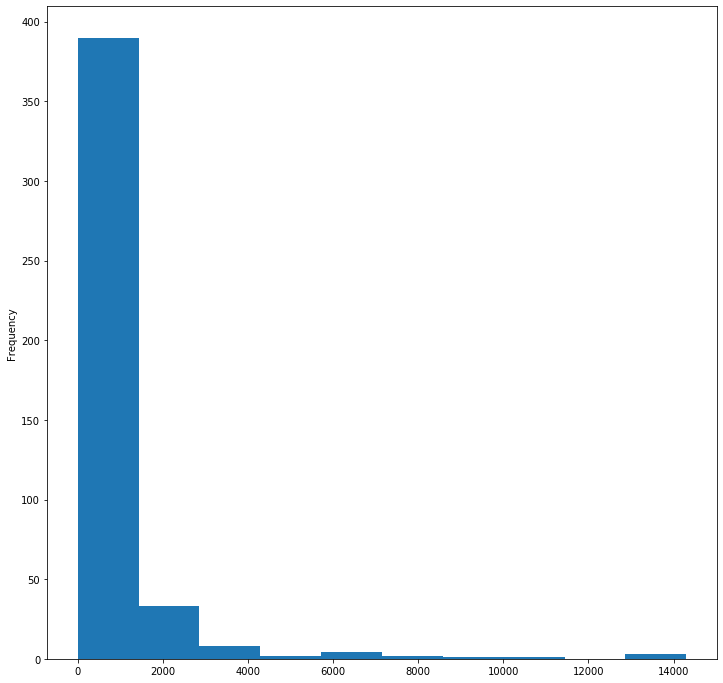
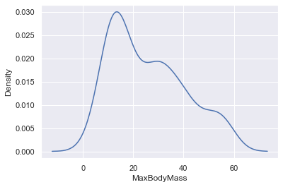

# Visualiser des distributions

A nouveau posons la question de l'intention : 
* Quelle est l'intention derrière la visualisation d'une distribution ? 
* Qu'est-ce que l'on cherche à faire grâce à la visualisation d'une distribution ? 

Pour répondre à ces questions, commençons par cerner ce qu'est une distribution.

## Qu'est-ce qu'une distribution ?

Si l'on en reste à une définition froide, une distribution consiste tout simplement à organiser les données selon un point de vue. D'une certaine manière, une distribution permet de **fixer les données autour d'un point de vue**. 

Par exemple, imaginons que nous disposions d'un jeu de données comportant tout un tas de caractéristiques sur les oiseaux présents dans le parc de Yellowstone. Vous pourriez vouloir fixer les données autour d'un point qui serait **la masse maximale des espèces d'oiseaux**. 

Cela veut dire que pour une raison ou une autre, la seule chose qui vous intéresse, c'est cette **masse maximale**. Et vous vouloir savoir ce que le jeu de données a à vous dire sur cette masse maximale. 

## Quelle est l'intention derrière la visualisation d'une distribution ?

L'intention première d'une distribution, c'est de vouloir savoir ce que dit un jeu de données sur le point d'intérêt que l'on s'est fixé. 

Dans l'exemple choisi, le point d'intérêt, c'est la masse maximale des espèces d'oiseaux. Vous allez donc réorganiser votre jeu de données autour de ce point d'intérêt.

Cette réorganisation va consister à compter le nombre d'oiseaux dont la masse maximale se trouve dans un intervalle donnée (ci-dessous)

Cette distribution visualisée, vous savez que la plupart des oiseaux ont une masse maximale inférieure à 2000 grammes. 

## Qu'est-ce que l'on cherche à faire grâce à la visualisation d'une distribution ? 

La notion qui vient tout de suite une fois la question posée est : probabilité. 

De mon avis, visualiser une distribution permet d'accéder à un point de bascule qui va nous permettre de sortir du simple comptage d'occurences d'un phénomène (des quantités, voir leçon précédente) pour aller vers la probabilité que ce phénomène soit de telle ou telle manière. 

A ce moment là, on peut faire appel à l'artillerie lourde des statistiques et des mathématiques. Une artillerie qui va nous permettre de comprendre avec beaucoup plus de finesse le phénomène sur lequel les données portent ?

## Pourquoi la visualisation des distributions nous permet d'accéder à l'outillage des statistiques et des mathématiques ? 

Je crois que la réponse tient dans le fait qu'une distribution peut rapidement se transformer en **fonction**. 

Voyez ci-dessous comment l'on peut créer un grahique de densité (qui n'est qu'une autre forme de visualiser une distribution) 

Ce graphique semble cousin de celui qui représenterait une fonction, elle même permettant de calculer la probabilité que telle variable (dans notre exemple la masse maximale des oiseaux) ait telle valeur. 

| ](../../sketchnotes/10-Visualizing-Distributions.png)|
|:---:|
| Visualizing Distributions - _Sketchnote by [@nitya](https://twitter.com/nitya)_ |
